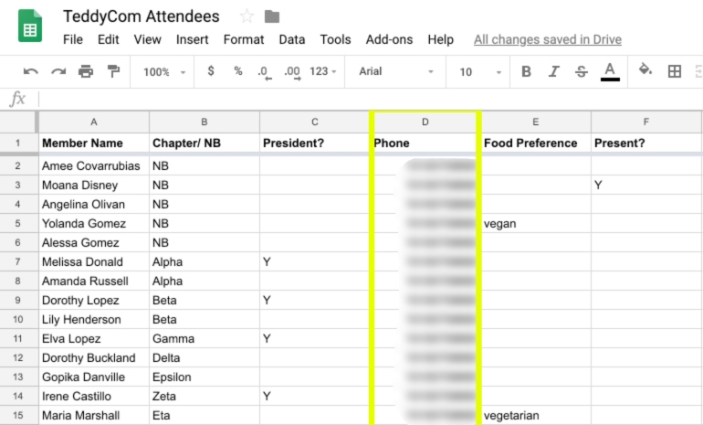

# TeddyCom

This command-line interface Ruby app is a one-way Twilio sms broadcast system for conferences or large events. Utilizing the Google Sheets API to use Google Sheets as the primary database of phone numbers, database accessibility becomes a breeze for small-medium organizations who already use Google Sheets for registration purposes. 



## Installation

Add this line to your application's Gemfile:

```ruby
gem 'teddy_com'
```

And then execute:

    $ bundle

Or install it yourself as:

    $ gem install teddy_com

## Usage

TODO: Write usage instructions here

## Development

After checking out the repo, run `bin/setup` to install dependencies. Then, run `rake spec` to run the tests. You can also run `bin/console` for an interactive prompt that will allow you to experiment.

To install this gem onto your local machine, run `bundle exec rake install`. To release a new version, update the version number in `version.rb`, and then run `bundle exec rake release`, which will create a git tag for the version, push git commits and tags, and push the `.gem` file to [rubygems.org](https://rubygems.org).

## Contributing

Bug reports and pull requests are welcome on GitHub at https://github.com/[USERNAME]/teddy_com. This project is intended to be a safe, welcoming space for collaboration, and contributors are expected to adhere to the [Contributor Covenant](http://contributor-covenant.org) code of conduct.

## License

The gem is available as open source under the terms of the [MIT License](https://opensource.org/licenses/MIT).

## Code of Conduct

Everyone interacting in the TeddyCom project’s codebases, issue trackers, chat rooms and mailing lists is expected to follow the [code of conduct](https://github.com/[USERNAME]/teddy_com/blob/master/CODE_OF_CONDUCT.md).
